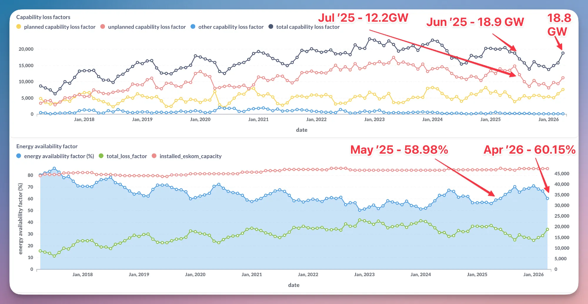
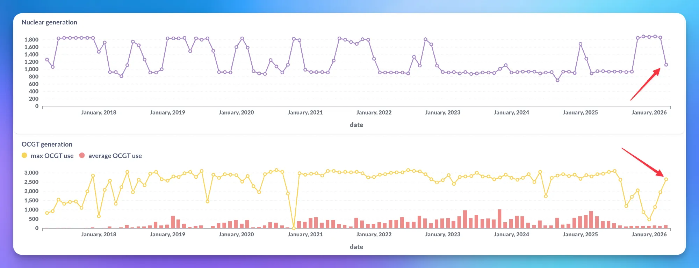
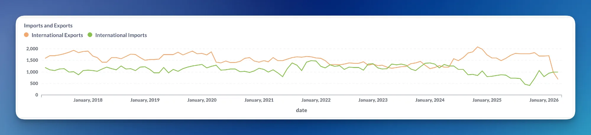
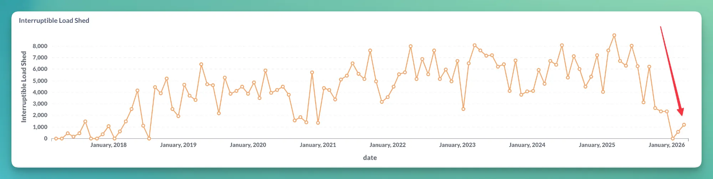
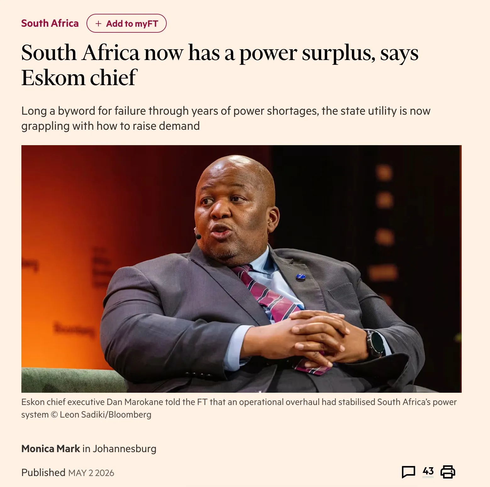
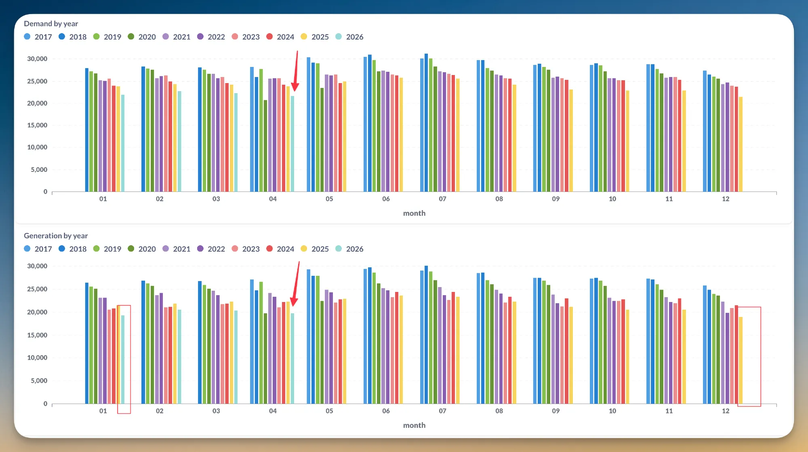
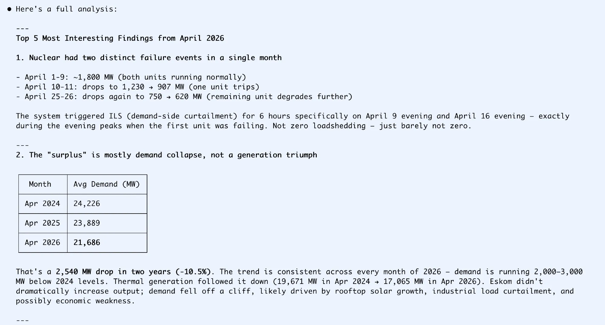

# Eskom Data Analysis: April 2026

*Published: 5 May 2026*

---

There have been many media statements around the end of the financial year about how well things are going at Eskom. In reality, things have not been going this badly in a while.

April 2026 saw:

- **Worst EAF since May 2025**
- **Highest unplanned outages since July 2025**
- **Highest total outages since June 2025**

*Capability loss factors (top) show total outages climbing back to 18.8 GW, while the Energy Availability Factor (bottom) dropped to 60.15% — the worst since May 2025.*

---

## Koeberg nuclear troubles

One unit at Koeberg shut down about a week before it was planned to go off for maintenance. The second unit is currently operating at 600 MW instead of 900 MW. Eskom has said nothing about either issue.

*Nuclear generation (top) shows the sharp drop in output. OCGT generation (bottom) is climbing again, with maximum use hitting 2.6 GW.*

---

## OCGT reliance returns

Open Cycle Gas Turbines (OCGTs) are being used to generate up to 2.6 GW again. The average is still okay, but things are clearly breaking. With diesel in short supply, it is not a great time to be dependent on OCGTs.

---

## Imports and exports

Exports dropped to the lowest level on record, falling below imports for the first time since May 2024. Neighbouring countries appear to be suffering as a result before South Africa does.

*International exports (orange) dropped below imports (green) for the first time since May 2024.*

---

## Interruptible load shedding

Eskom is also starting to use the interruptible load shed lever again to reduce demand when needed. This is still small compared to even January, but it undermines the claim that South Africa has a power surplus.

*Interruptible load shedding is ticking up again after months of near-zero use.*

---

## The "surplus" narrative

Despite these issues, Eskom continues to push out statements about how good things are.

*An FT article from 2 May 2026 quotes Eskom chief executive Dan Marokane claiming South Africa now has a power surplus.*

---

## Demand collapse masks the problem

For now, South Africa is still very much relying on historically low demand — almost exactly the same as April 2020 when everything shut down for Covid.

*Demand (top) and generation (bottom) for April 2026 are at levels comparable to April 2020, driven by rooftop solar growth, industrial load curtailment, and possibly economic weakness.*

---

## Sonnet 4.6 analysis

Here's an AI analysis from Sonnet 4.6 also focusing on the nuclear wobbles and the demand collapse:

*Sonnet 4.6 identified two distinct Koeberg failure events in April 2026 and noted that the claimed "surplus" is largely a demand collapse rather than a generation triumph — average demand fell from 24,226 MW in April 2024 to 21,686 MW in April 2026, a drop of 2,540 MW (-10.5%).*

---

## Outlook

Hopefully this is just a temporary setback before getting back on the improvement train again. But with diesel in short supply, rising dependence on OCGTs, and a lack of transparency around Koeberg's status, the gap between Eskom's public statements and the underlying data is widening.

---

*Data and charts from [unofficialeskom.com](https://unofficialeskom.com). Corrections and questions welcome.*
