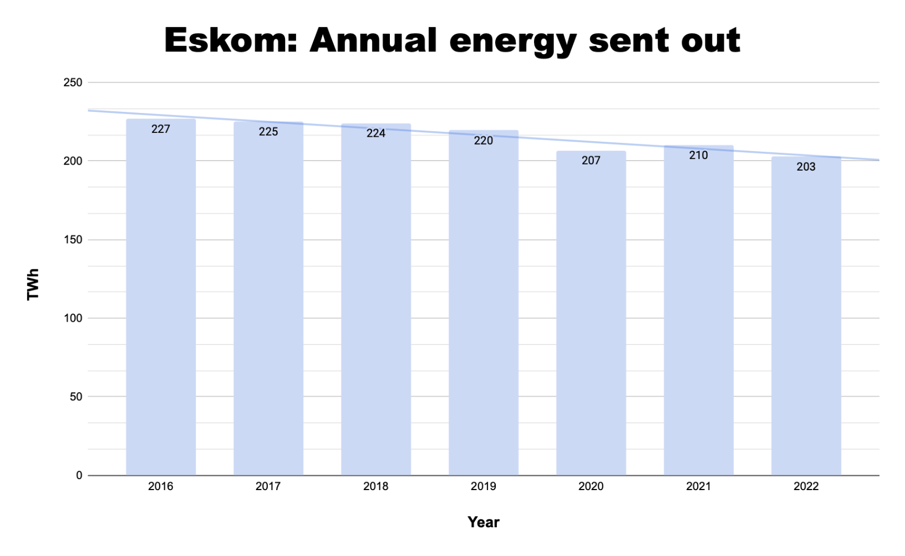

# Long term dashboards

The [short-term dashboards](./index.md) show trends over days, weeks or months. These are based on Eskom's [longer term data dumps](https://www.eskom.co.za/dataportal/data-request-form/) which they make available on request, or by manually extracting data from Eskom's presentations, annual reports and integrated results.

## Capability loss factors

Planned, unplanned, other and total capability loss factors. See a larger version [here](https://metabase.dwyer.co.za/public/question/cfe76e88-8a61-4e38-9b01-a7372e895527).

<iframe    src="https://metabase.dwyer.co.za/public/question/cfe76e88-8a61-4e38-9b01-a7372e895527"    frameborder="0"    width="800"    height="600"    allowtransparency></iframe>

## Annual energy out

The total energy Eskom sends out annually has been trending down for at least five years. This is shown in the following graph extracted from Eskom's [weekly system reports](https://www.eskom.co.za/eskom-divisions/tx/system-adequacy-reports/).

