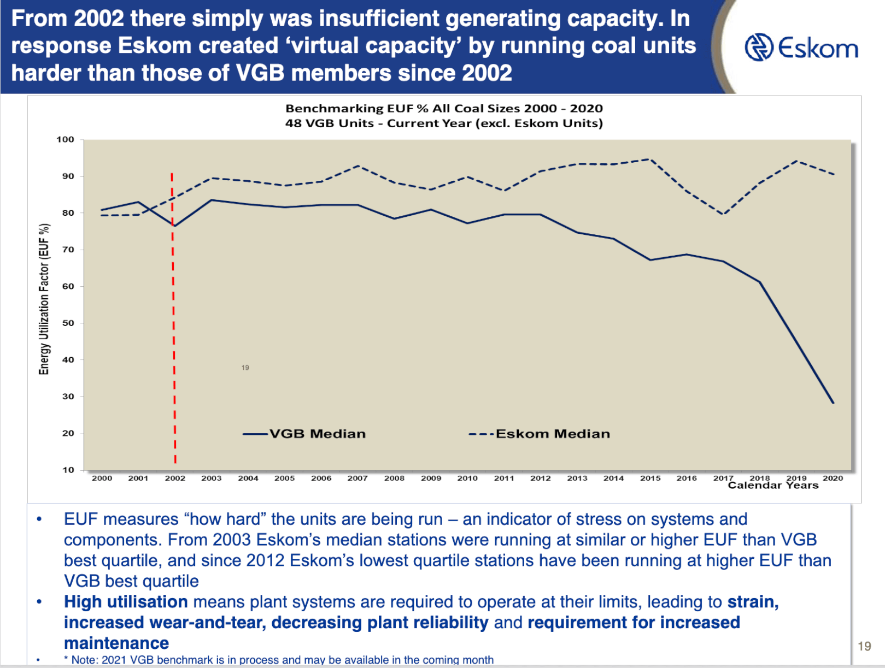

# FAQ

## Why can't Eskom generate enough power?

It's controversial but probably because of [state capture](https://www.bbc.com/news/world-africa-48980964) and general corruption in South Africa and especially at [South Africa's State Owned Enterprises](https://en.wikipedia.org/wiki/State-owned_enterprises_of_South_Africa). 

Because Eskom failed to build new generation capacity, it ran its aging power plants far harder than it should have. (Eskom [benchmarks](https://www.eskom.co.za/wp-content/uploads/2021/02/Eskom_fact_sheets_2015.pdf) the performance of its coal-fired power stations against those of the members of Vereinigung der Großkesselbesitzer, a European-based technical association for electricity and heat generation industries.)

Here's a graph showing the utilization factor of Eskom's plants compared to VGB benchmarks. 

