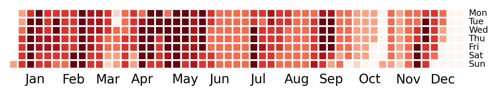

# Heatmap calendar

We have been loadshedding continuously for 156.5 hours, since 2023-08-11 15:30:00. The longest stage 1 (or more) streak started on 2023-02-05 16:00:00 and ended on 2023-03-19 05:00:00, for a total of 997.0 hours. The longest stage 6 (or more) streak started on 2023-02-19 20:00:00 and ended on 2023-02-26 05:00:00, for a total of 153.0 hours.

Loadshedding since 2015 - darker shades indicate a higher max loadshedding stage on that day. Blank squares indicate no load shedding on that day. Data from [EskomSePush (ESP)](https://sepush.co.za)'s [spreadsheet](https://docs.google.com/spreadsheets/d/1ZpX_twP8sFBOAU6t--Vvh1pWMYSvs60UXINuD5n-K08/edit#gid=863218371).

### 2015

### 2016

### 2017

### 2018

### 2019

### 2020

### 2021

### 2022

### 2023

### Legend

