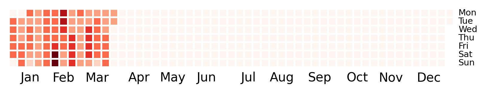
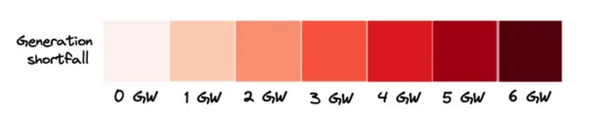

# Heatmap calendar
W
e
 
h
a
v
e
n
'
t
 
h
a
d
 
l
o
a
d
s
h
e
d
d
i
n
g
 
f
o
r
 
4
9
1
.
5
 
h
o
u
r
s
,
 
s
i
n
c
e
 
2
0
2
4
-
0
3
-
2
6
 
0
4
:
3
0
:
0
0
.

T
h
e
 
l
o
n
g
e
s
t
 
s
t
a
g
e
 
1
 
(
o
r
 
m
o
r
e
)
 
s
t
r
e
a
k
 
s
t
a
r
t
e
d
 
o
n
 
2
0
2
3
-
0
2
-
0
5
 
1
6
:
0
0
:
0
0
 
a
n
d
 
e
n
d
e
d
 
o
n
 
2
0
2
3
-
0
3
-
1
9
 
0
5
:
0
0
:
0
0
,
 
f
o
r
 
a
 
t
o
t
a
l
 
o
f
 
9
9
7
.
0
 
h
o
u
r
s
.

T
h
e
 
l
o
n
g
e
s
t
 
s
t
a
g
e
 
6
 
(
o
r
 
m
o
r
e
)
 
s
t
r
e
a
k
 
s
t
a
r
t
e
d
 
o
n
 
2
0
2
3
-
0
2
-
1
9
 
2
0
:
0
0
:
0
0
 
a
n
d
 
e
n
d
e
d
 
o
n
 
2
0
2
3
-
0
2
-
2
6
 
0
5
:
0
0
:
0
0
,
 
f
o
r
 
a
 
t
o
t
a
l
 
o
f
 
1
5
3
.
0
 
h
o
u
r
s
.
### 2015

### 2016

### 2017

### 2018

### 2019

### 2020

### 2021

### 2022

### 2023

### 2024

### Legend

