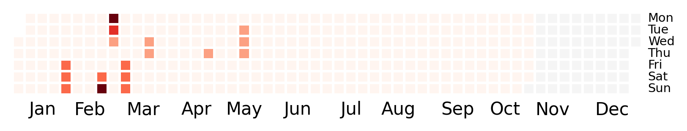

# Heatmap calendar
<i>Last updated: 2025-06-15 03:00:00</i>

We haven't had loadshedding for 725.5 hours, since 2025-05-15 21:30:00.

 We broke the record set between 2014-06-17 19:00:00 and 2014-11-02 07:30:00 lasting 3300.5 hours.

The next record to break is the one between 2018-06-16 21:00:00 and 2014-11-18 12:00:00 lasting 3711 hours.

The longest stage 1 (or more) streak of continuous loadshedding started on 2023-02-05 16:00:00 and ended on 2023-03-19 05:00:00, for a total of 997.0 hours.

The longest stage 6 (or more) streak started on 2023-02-19 20:00:00 and ended on 2023-02-26 05:00:00, for a total of 153.0 hours.
 data from Eskom se Push [Google Sheet](https://docs.google.com/spreadsheets/d/1ZpX_twP8sFBOAU6t--Vvh1pWMYSvs60UXINuD5n-K08/edit#gid=863218371)
### 2015

### 2016

### 2017

### 2018

### 2019

### 2020

### 2021

### 2022

### 2023

### 2024

### 2025

### Legend

