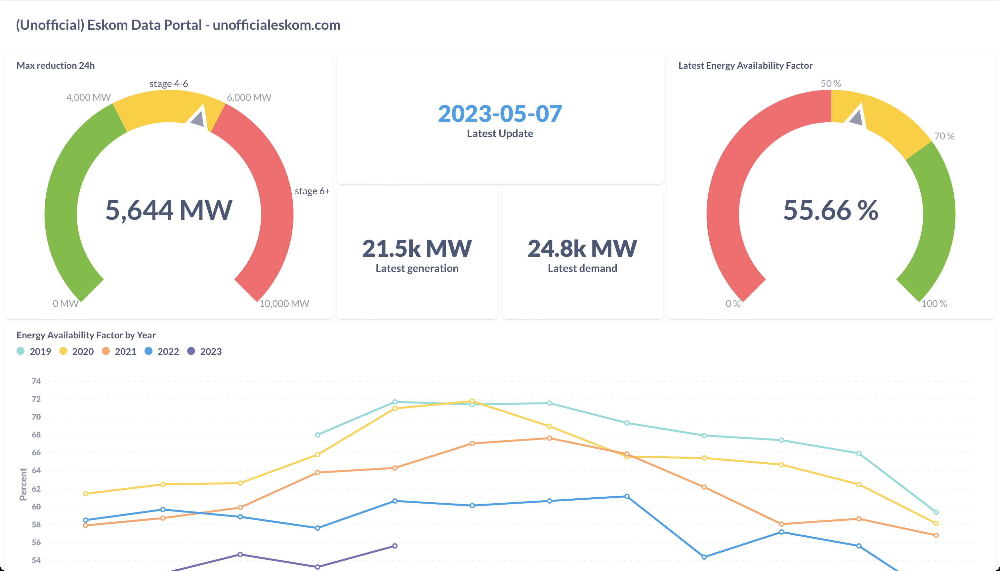

# Unofficial Eskom

[Eskom](https://www.eskom.co.za), the South African electricity public utility,  provides some information about the ongoing [South Africa energy crisis](https://en.wikipedia.org/wiki/South_African_energy_crisis). 

However, the official data is often badly presented or hard to find. This is an unofficial site that aggregates the most useful information and makes it easier to find, nicer to look at, and generally more accessible.

Mainly this is collected in the "Unofficial Eskom Data Portal" dashboard, which you can find [here](https://metabase.dwyer.co.za/public/dashboard/d3b40619-d8f0-4be3-a1f2-99fe5b84e961).

But you can also find some other information around at the [Dashboards](./dashboards), and a [heatmap](./heatmap) showing a calendar overview of loadshedding since 2015.

We aggregate data from:

* The Eskom [data portal](https://www.eskom.co.za/dataportal/).
* The Eskom [Integrated results](https://www.eskom.co.za/investors/integrated-results/).
* The Eskom [presentations](https://www.eskom.co.za/media-room/presentations/).
* The Eskom [weekly system status reports](https://www.eskom.co.za/eskom-divisions/tx/system-adequacy-reports/).
* The Eskom [media statements](https://www.eskom.co.za/category/news/) and [Twitter feed](http://twitter.com/eskom_sa).
* [EskomSePush (ESP)](https://sepush.co.za).

See the links in the header for more.

**WIP - not everything above is actually live yet. Stay tuned.**

